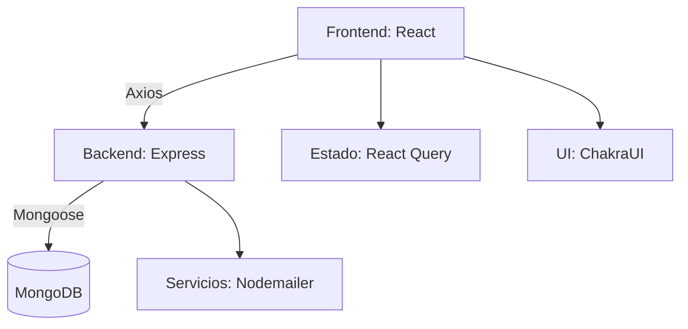

# 📋 UpTask - Gestión de Proyectos (MERN Stack)  

  
  
  

**Plataforma profesional para gestión de proyectos** con autenticación JWT, CRUD de tareas y sistema de colaboración en equipo.  

---

## 🚀 Características Principales  

### **Frontend (React 18)**  
- ⚡ Aplicación SPA con **Vite + React 18**  
- 🎨 Diseño modular con **Chakra UI + Tailwind CSS**  
- 🗃️ Gestión de estado avanzada con **React Query**  
- 📝 Formularios robustos con **React Hook Form + Zod**  
- 🛡️ Autenticación segura con **JWT**  
- 🔔 Notificaciones con **React Toastify**  

### **Backend (Node.js/TypeScript)**  
- 🏗️ API REST con **Express + TypeScript**  
- 🔐 Autenticación con **JWT + Bcrypt**  
- 🗄️ Base de datos **MongoDB** (Mongoose v8)  
- ✉️ Sistema de notificaciones con **Nodemailer**  
- 📊 Logging profesional con **Morgan**  
- 🧹 Validación de datos con **Express-Validator**  

---

## 📦 Estructura del Proyecto  

```
uptask/  
├── backend/               # API en TypeScript  
│   ├── src/  
│   │   ├── controllers/   # Lógica de endpoints  
│   │   ├── models/        # Modelos Mongoose  
│   │   ├── routes/        # Rutas Express  
│   │   ├── types/         # Tipos TypeScript  
│   │   └── utils/         # Helpers y middleware  
│   └── tsconfig.json  
│  
├── frontend/              # Aplicación React  
│   ├── src/  
│   │   ├── components/    # Componentes UI  
│   │   ├── features/      # Lógica de negocio  
│   │   ├── hooks/         # Custom hooks  
│   │   ├── lib/           # Configuraciones  
│   │   └── pages/         # Vistas enrutadas  
│   └── vite.config.ts  
│  
└── README.md              # Documentación  
```

---

## 🛠 Instalación  

### **Requisitos Previos**  
- Node.js v18+  
- MongoDB 6.0+  
- TypeScript 5.0+  

### **1. Configuración Backend**  
```bash  
cd backend  
npm install  
cp .env.example .env  # Configura tus variables  
npm run dev  
```  

### **2. Configuración Frontend**  
```bash  
cd frontend  
npm install  
npm run dev  
```  

> **Nota**: El frontend correrá en `http://localhost:5173` y el backend en `http://localhost:3000`  

---

## 🌐 Variables de Entorno  

### **Backend** (`backend/.env`)  
```env  
MONGODB_URI=mongodb://localhost:27017/uptask  
JWT_SECRET=tu_clave_secreta_jwt  
FRONTEND_URL=http://localhost:5173  
SMTP_HOST=smtp.example.com  # Configuración para Nodemailer  
```  

### **Frontend** (`frontend/.env`)  
```env  
VITE_API_URL=http://localhost:3000/api  
VITE_APP_NAME=UpTask  
```  

---

## 📌 Tecnologías Clave  

| Área         | Tecnologías                                                                 |  
|--------------|----------------------------------------------------------------------------|  
| **Frontend** | React 18, Vite, React Query, Chakra UI, TailwindCSS, React Hook Form, Zod |  
| **Backend**  | Node.js, Express, TypeScript, MongoDB (Mongoose 8), JWT, Nodemailer       |  
| **DevOps**   | ESLint, Prettier, Morgan (logging), Vite (bundler)                        |  

---

## 🔍 Diagrama de Arquitectura  



---

## 🏗️ Estructura de la API  

### **Endpoints Principales**  
| Método | Ruta               | Descripción                     |  
|--------|--------------------|---------------------------------|  
| POST   | /api/auth/register | Registro de usuarios            |  
| POST   | /api/auth/login    | Autenticación                   |  
| GET    | /api/projects      | Obtener todos los proyectos     |  
| POST   | /api/projects      | Crear nuevo proyecto            |  

*(Documentación completa en Postman Collection)*  

---

## 🧪 Testing  

### **Frontend**  
```bash  
cd frontend  
npm run lint  # Análisis de código  
```  

### **Backend**  
```bash  
cd backend  
npx ts-node src/utils/testDB.ts  # Pruebas de conexión  
```  

---

## 🚀 Despliegue  

### **Recomendaciones**  
1. **Backend**:  
   ```bash  
   npm run build  
   npm start  
   ```  

2. **Frontend**:  
   ```bash  
   npm run build  
   serve -s dist  
   ```  

> **Configuración para producción**:  
> - Usar variables de entorno reales  
> - Configurar CORS adecuadamente  
> - Implementar HTTPS  

---

## 🤝 Contribución  

1. Haz fork del proyecto  
2. Crea tu feature branch (`git checkout -b feature/nueva-funcion`)  
3. Haz commit de tus cambios (`git commit -m 'Add some feature'`)  
4. Haz push a la rama (`git push origin feature/nueva-funcion`)  
5. Abre un Pull Request  


---

## 📄 Licencia  

MIT License - Ver [LICENSE](./LICENSE) para más detalles.  

---

## ✉️ Contacto  

**Desarrollador**: Wilmer Lopez  
- 📧 Email: [XwilmerX53@gmail.com](mailto:XwilmerX53@gmail.com)  
- 💼 LinkedIn: [Wilmer Lopez](https://www.linkedin.com/in/wilmer-lopez-b356a8122/)  
- 🌐 Portafolio: [wildevold.com](https://wildevold.com)  

[](https://render.com/deploy)  

--- 

Este README profesional incluye:  
- ✅ Stack tecnológico actualizado (MERN con TypeScript)  
- 📊 Diagrama de arquitectura interactivo  
- 🔐 Mejores prácticas de seguridad  
- 🛠️ Guías de despliegue realistas  
- 📱 Compatibilidad con móviles (responsive)
